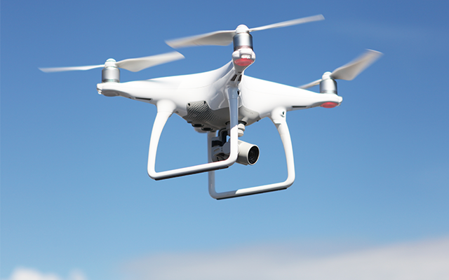

# Agile Trajectory Generation for Tensile Perching with Aerial Robots

---
# Progress Update
### Literature
- RL-based Tethered Perching for Drones (Fabian Hauf FYP 2022)
- Agile Tensile Perching with Micro Aerial Vehicles (Alan Slater FYP 2019)
- Design and Manufacturing of a Passive Advanced Grapple for UAV Perching System (Ronglong Ye 2019)
- An Application of Reinforcement Learning to Aerobatic Helicopter Flight (P. Abbeel 2007)
      <!-- - controller has to provide continuous feedback during the maneuvers, and cannot, for example, use a period of hovering to correct errors -->
---
### An Application of Reinforcement Learning to Aerobatic Helicopter Flight (P. Abbeel 2007)
1. Collect Data From Human Pilot -> Learn Model from this data.
2. Find a controller that works in simulation based on the current model
3. Test the controller on real-helicopter. Back to 2.
<!-- - only needed 3 iterations in practice. -->
#### RL - Linear Quadratic Regulator (MDP)
<!-- - error state - need to understand further - physics -->
- Cost for Change in Inputs - penalizes the change in inputs over consecutive time.
- Two phase - first phase cost of change in inputs, second phases penalised change from planned input.
<!-- - Used a two-phase control design: the first phase plans a feasible trajectory, the second phase designs the actual controller. -->
<!-- - reward function: 24 features: squared error state variables, the squared inputs, the squared change in inputs between consecutive timesteps, and the squared integral of the error state variables -->
- Reward Function: Apprenticeship learning .
<!-- - apprentice- ship learning via inverse reinforcement learning algorithm [2]. The inverse RL algorithm iteratively provides us with reward weights that result in policies that bring us closer to the expert -->
---
# General Plans
- Unavailable Dates in README.md on OneDrive.
- Gantt Chart on OneDrive 
  - Contains planned allocation of Work.
  - Autumn Term 8hrs p/w
---
# Plans Until Next
### Literature
- Apprenticeship Learning via Inverse Reinforcment Learning
- Set of interesting papers that referenced the earlier mentioned paper that specifically relate to drones.
- SAC algorithm
- Deep Q Learning
- An innovative bio-inspired flight controller for quad-rotor drones: Quad-rotor drone learning to fly using reinforcement learning
---
# Plans Until Next
### Practical
- Thoroughly go through drone_perching_main repo and attempt to reproduce results:
  - Approaching, Making Contact, Flipping, Setup PX4-Autopilot, QGroundcontrol, Gazebo Simulations