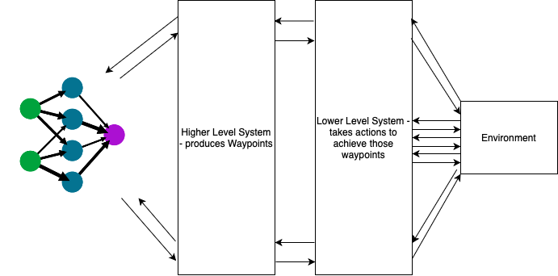

# Agile Trajectory Generation for Tensile Perching with Aerial Robots

---
# Progress Update
Focussed around the learning from previous demos of the approaching stage.
- Adapted the environment to be part of a gym wrapper & standard baselines wrapper.
  - Gym: Framework of RL environments.
  - Standard Baselines: Set of reliable RL algorithms in PyTorch.
- Demonstration data
  - Have uploaded a Demonstrations.pdf to Progress Updates folder on OneDrive - Luca.
  - Planning on sending this to Luca/Maxi this afternoon.
  - Currently reviewing the optimised style demonstrations from Hann.

---
- Action
  - Originally using a single step action system i.e. the drone takes a very small movement action.
  - Adapted to use the 2 level system i.e. waypoints - defined as wrappers
    - Has a target waypoint, keeps heading in the direction of the waypoint until it reaches "close" and then selects its next waypoint to follow. Currently takes a fixed size movement toward it.
    - Next step - Bezier Curve Path following - less abrupt changes and smoother movements.

---
- Next Steps from previous update.
  - Fixed starting positions
    - Randomly start in a ring around the tree branch.
  - Simulator Staying Alive - Can't save new trajectories.
    - Seems to be an issue between current version of macos, opengl and pybullet - others have commented on this issue online.

    - Keep simulator - changed so that the simulation environment is not closed by default - temporary fix.
    - Headless version - without a GUI.

  - Speed
    - Headless: Currently only implemented a "human" env, want a way in the wrapper to not show the GUI. (52%)
      - now implemented a headless version
    - Parallelisation: Stable Baselines provides relatviely straightforward methods to use multiple enviornments at the same time - in parallel.
  
---
- Next Steps
  - Run on current data
  - Demonstrations
    - Hann
      - Generate a set of optimised trajectories from Hann's code.
    - Luca
      - Provide the demonstrations.pdf to explain what is required.
  - Learning from Demonstrations
    - Currently priming the replay buffer with the demonstration data.
    - True algorithm maintains two different buffers and produces different updates.
  - Two Level System
    - Using curves for waypoints.
    - Tuning the maximum distance between waypoints.

---
# Questions
- Could you review the demonstrations.pdf file for if there's anything missing before I send to Luca & Maxi?