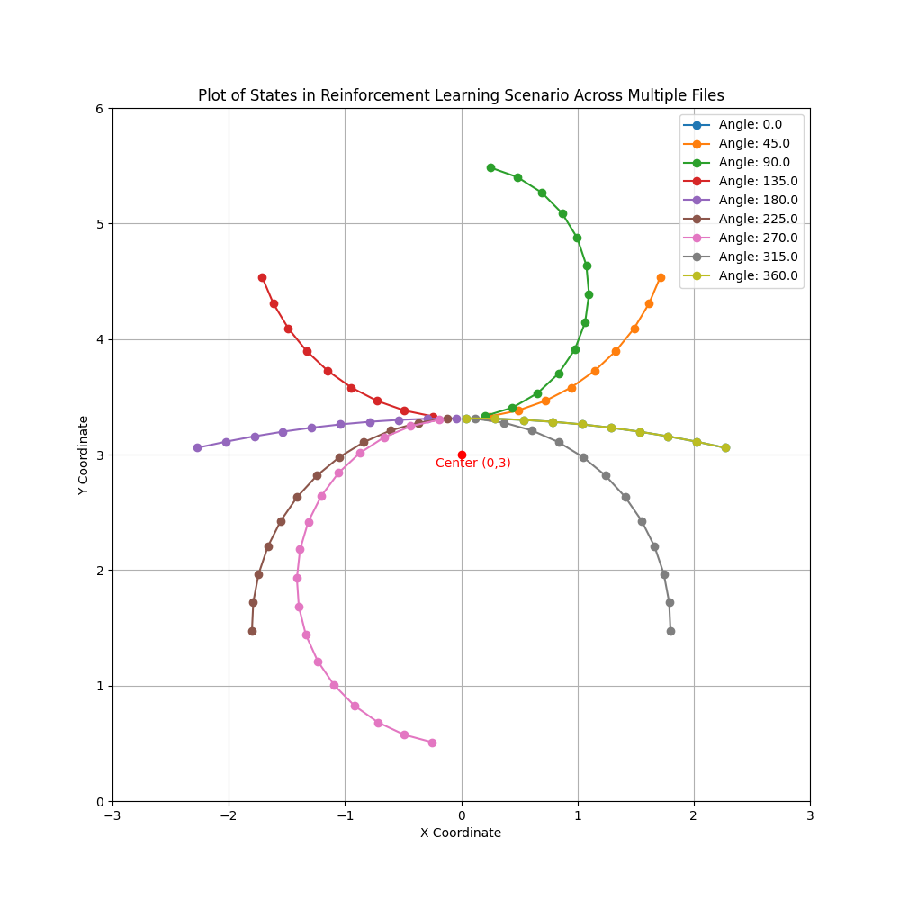
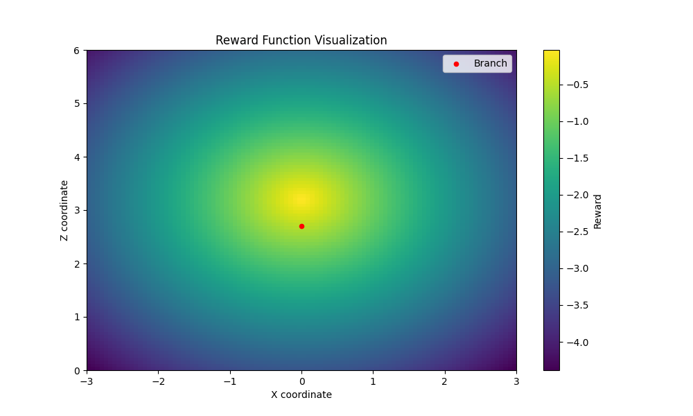
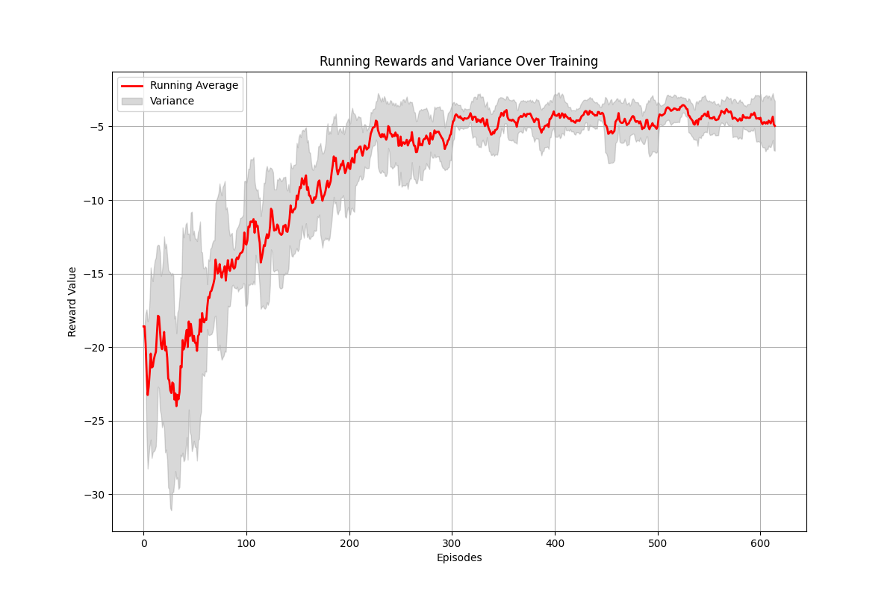
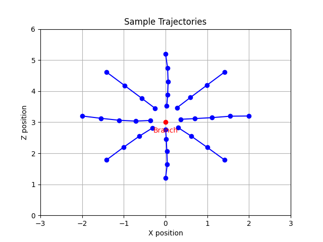
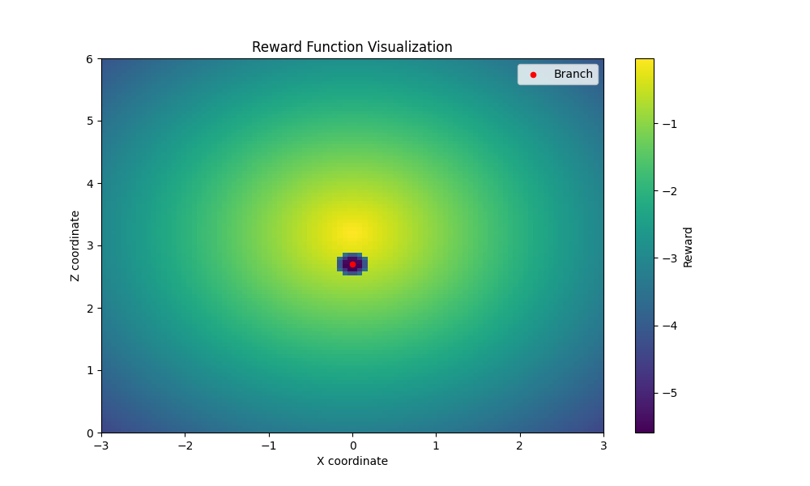
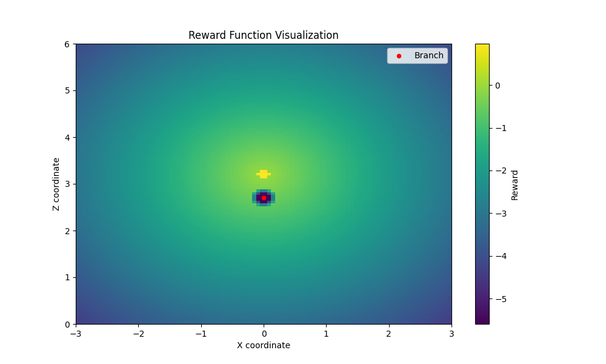
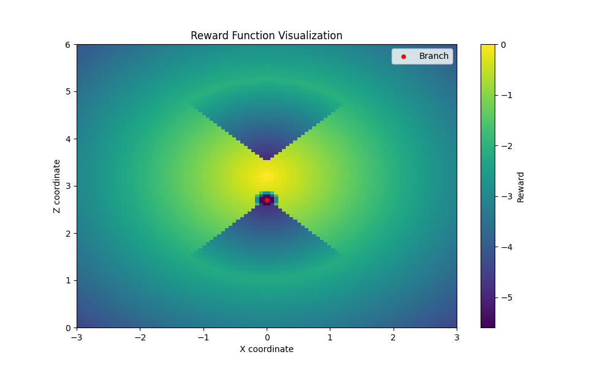
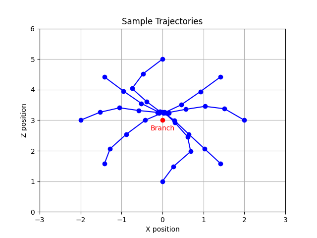
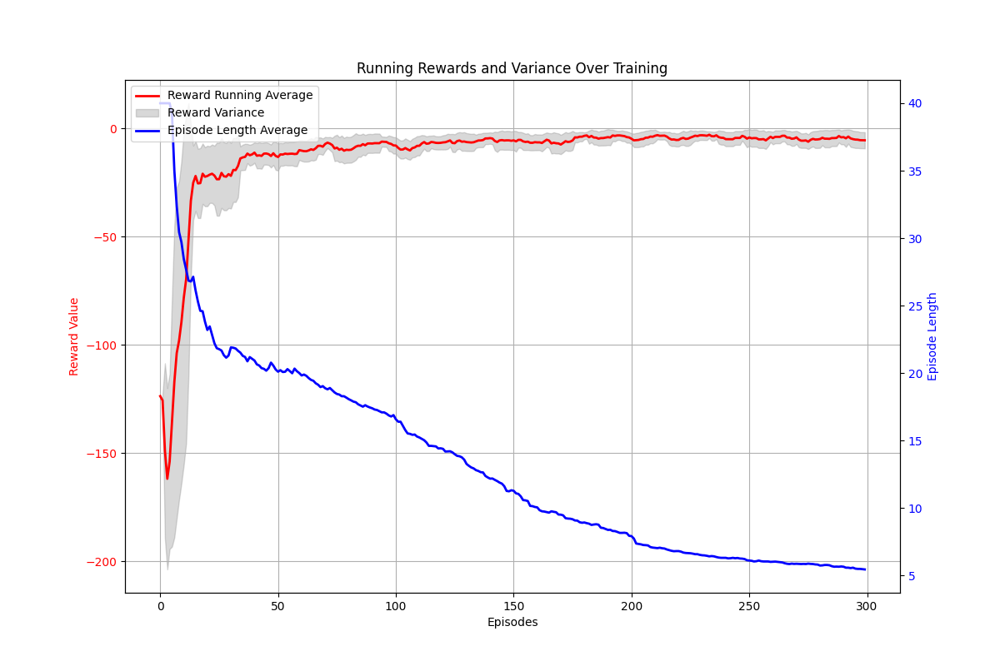

# Agile Trajectory Generation for Tensile Perching with Aerial Robots

---
# Progress Update
- Demonstrations
  - Demonstrations from both optimised trajectory (Hann) and Previous Work (Fabian).
  - Using these demonstrations in training.

---
# Last Week

---

---

---

---

# From Previous Week
- Issues faced
  - Resetting - fixed an issue an issue with gravity in resetting.
  - Reward Function 
    - done based on hitting tether to branch - stop condition is when there is a collision between the centre portion of the tether and the branch.
    - collision - penalise contact between drone and branch - large collision penalty.
    - Trajectory Smoothness Term
- Learning from Demonstrations System
- By next week: Approaching stage finished with comparison results between SAC and SACfD.

---
# Reward

---

---

---

---
# Trajectories

---
# Comparison between SAC and SACfD

---

---
# Next Steps
- Further Statistics on the training
  - Crashes.
- Smoothness
  - Already a smoothness term which can be seen in easy tasks.
  - Introduce Prioritised Experience Replay to help combat the harder learning portions.
  - Sampling learnable parameter.
- Move onto next stage:
  - Wrapping

---
# Questions
- For the paper:
  - How would you suggest going about cutting down the background/related work section?
