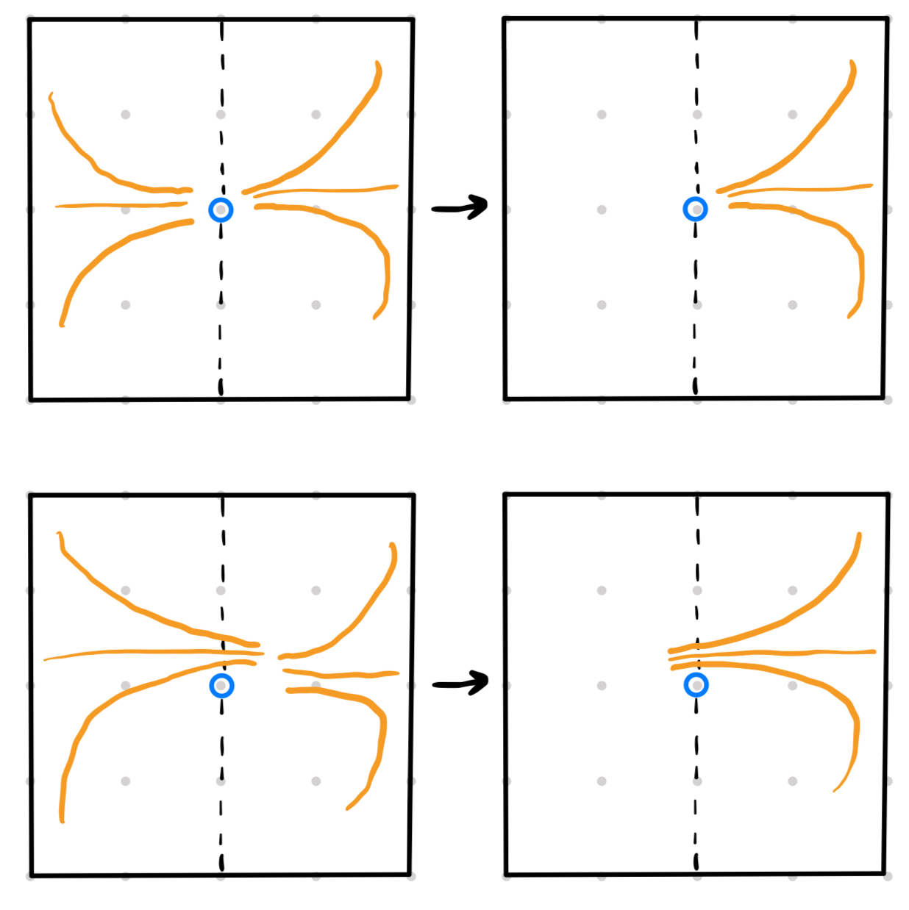
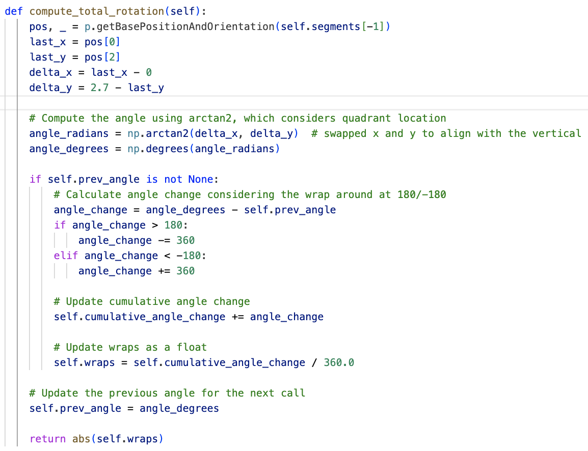

# Agile Trajectory Generation for Tensile Perching with Aerial Robots

---
# Progress Update
- Demonstrations
  - Waiting on Atar/Kangle for update on demonstrations - I have messaged Atar this morning to see if there's anything that I can help with and update.

---
# From Previously
- Issue around wrapping from different sides.
  - Starting position in state space
  - Previous n states
  - Discussion last time.
    - Take advantage of the symmetry in the environment.
    - More mathematical information on the Reward Function.

---
# Symmetry
We can assume symmetry across the x=0 plane i.e. from either approaching side of the branch.

Symmetrical Wrapper
- Takes in the positions and actions and converts the positions to be +ve with respect to the starting position.
- Making the problem easier to solve by only needing to learn from one side.
- Implemented as a Gym Wrapper so that it is easy to add/remove to compare the learning effects.

---
### Symmetry Diagram

<!-- ---
### Symmetric Tragectories -->
---
# Reward Function
Reward is currently calculated in levels: 
- Approaching: $r_1 = - dist(x_{state}; a_{target})$

- Wrapping: $r_2 = num\_wraps(x)$

- Hanging: $r_3 = max(1 \text{ if } within(x_{state}; h_{box} \text{ else } 0), - dist(x_{state}; h_{target})  )$

- Overall:

  - If num_wraps > 1:
    - $r = scale(r_3; -1, 0)$

  - Otherwise:
    - $r = scale(r_2 + r_1; -3, 0)$ otherwise

---
# Further Mathematics
- Distance: $dist(x, target) =  norm_{L2}(x, target)$
- Number of Wraps: Algorithm on next slide - based around the position of the two ends of the tether - tracking through different timesteps to calculate rotation.
- Scale: $scale(x; min_x, max_x, a, b) = ((x - min_x) / (max_x - min_x) \text{ x } (b - a))$

---
# Num Wraps

# Hanging Reward Visual

---
# Stages

Approaching
- Speed - visually much shorter and faster trajectories - need to gather some additional data on this for evaluation purposes.

Wrapping
- Waiting
  - Previously using the position of the weight which allowed the network to learn when to move onto the next state.
  - In deployment - This would be complex to actaully keep track of in real life - want to aviod this being part of the state space so that the agent can make decisions without this additional knowledge.
  - Incorporate previous state information - "hovering steps" - keep track of how long the agent has hovered - make decisions based on time in a learned manner.

---
Hanging
- Trajectories with a swinging motion underneath.
  - Questions

---
Sample Approaching Trajectories

---
# Report Plan
- Intro - Background
- Methodology
  - Environmental Modelling
    - Initial Environment
      - Pybullet Environment
      - Tether Modelling
    - Wrappers
      - Dimension
      - Symmetry
      - Memory
      - Timestep
  - Training
    - Reward Function Design
    - Algorithms
    - Demonstrations
---
- Results
  - Trajectory Experiments
  - Speed
- Conclusion

---
# Overall Plan
- Report Deadline 17th June
  - Week 13th - 20th May --------- Finish Wrapping
  - Week 20th - 27th May --------- Demontration Integration & Experiments
  - Week 27th May - 3rd June  ----- Evaluation, Experiments, Report
  - Week 3rd - 10th June ---------- Evaluation, Experiments, Report
  - Week 10th - 17th June -------- Report
