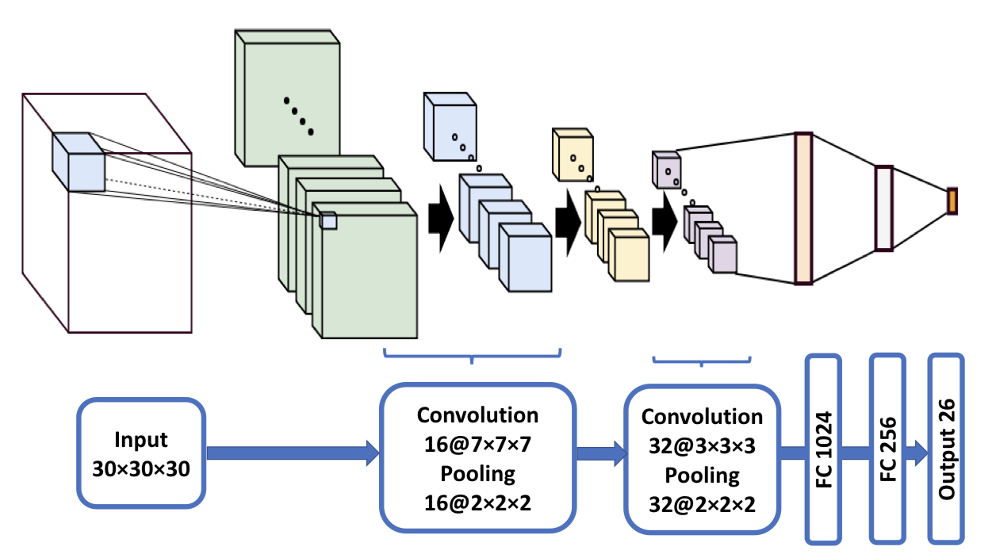
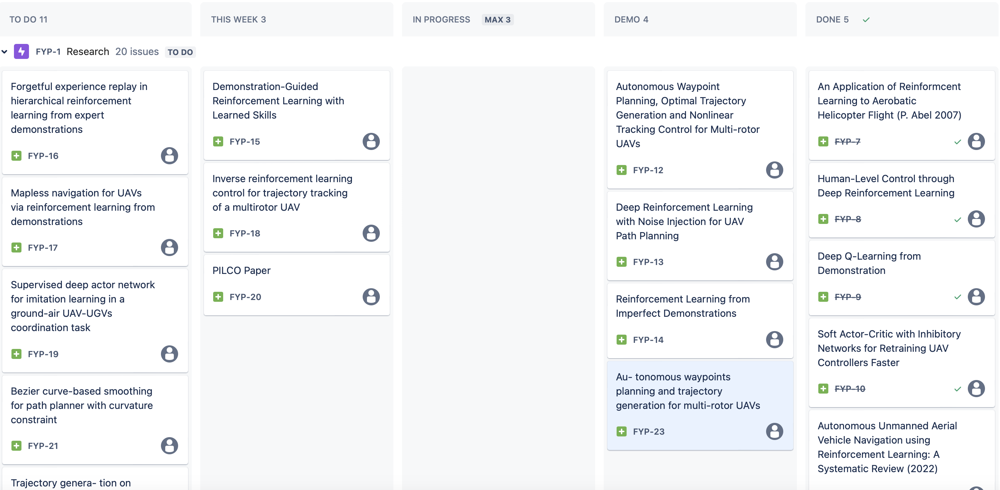

# Agile Trajectory Generation for Tensile Perching with Aerial Robots
- Generate trajectories for the aerial robot to perch on the tree branch using a tethered perching mechanism with a pendulum like structure.

---
# Progress Update
### `Autonomous Waypoint Planning, Optimal Trajectory Generation and Nonlinear Tracking Control for Multi-rotor UAVs`
- Overview of the system - doesn’t go into full details about the DQN Network. This is presented in `Autonomous waypoints planning and trajectory generation for multi-rotor UAVs`
- Select waypoints avoiding obstacles in a known 3D environment.
- Use a DQN Network to select waypoints, and then analytically solve these using Bexier Curves 
- Discritised 3D environment into N x N x N grid.
- Used a combination of:
  - Reaching target position
  - Reaching the target position without colliding
  - Minimizing thrust cost

---
### `Autonomous waypoints planning and trajectory generation for multi-rotor UAVs`
- Techical implementation from `Autonomous Waypoint Planning, Optimal Trajectory Generation and Nonlinear Tracking Control for Multi-rotor UAVs`
- Motivation 
  - Non-smooth trajectories being generated that are diffciult for UAVs to precisely follow.
  - Existing solutions learn the specific environment rather than learning the relationship between optimal control and surrounding environments.
- Two-level System:
  - High Level: Sequence of waypoints generated
  - Lower Level: Optimal trajectory calculated analytically (bezier curves)

---
- Deep Q-Network - First allowed to discover its own dynamics (very short episode maximums in simulation) then Learn how to cope with its own external environment.

- Interesting points of the problem
  - N x N x N grid-based approach
  - Deep Q-Network with 3D Convolution layers
  - Reward: Reaching Target + -L1 of thrust cost (energy)
  - Progressive learning in a controlled enviornment

---
### `Reinforcement Learning from Imperfect Demonstrations`
- Motivation
  - Existing methods presume near-optimal demonstrations, and require a combination of several distinct losses
  - Poor performance from standard methods. Demonstration data has a strongly biased sample. When trained only on good data, it has no way to udnerstand why the action taken is appropriate. It may assign high Q values but not necessarily assign low Q-values to alternative actions

- Normalised Actor-Critic - unified loss function to process both off-line demonstration data and on-line experience.
  - Performs well from corrupted or even partially adversarial demonstrations.
  - Normalizes the Q-function over the actions - reduces Q values from non-observed actions.

---
### `Deep Reinforcment Learning with Noise Injection for UAV Path Planning`
- Proposes Gaussian Noise Injection in Path Planning
- Technique from deep learning to prevent or reduce overfitting - adding noise to activation functions, weights, gradients or outputs.
- Used a Gaussian Noise layer after a CNN.
- More stable Q values - converge in similar time but remain more stable throughout the training process.

---
# General Plans
- Set up a Jira Board
- Ticket for each paper - link papers, add notes

---
# Plans Until Next
- Break for exams

- Reinforcment Learning from Demonstration
- Waypoint generation

---
# Questions
- How to structure research - a lot of different areas to explore. How do I manage breadth and depth?

---
# Feedback