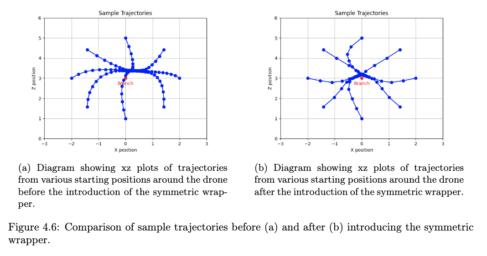

# Agile Trajectory Generation for Tensile Perching with Aerial Robots

---
# Progress Update
- Practical Experiments
  - After meeting with Atar last week - with drones available - switch to ROS2, latest version of Gazebo
  - Demo
  - Wednesday + Thursday - Based around converting the controller to ROS2
  - Friday Experiments
    - Came across a lot of techical issues
    - Added in an additional safety mechnaism allowing Atar to take control via a remote control when needed.
    - By Friday evening we managed to run some trajectories and achieved a full successful manuever on the first run at full speed.

---
# Report
Introduction
  - Description of Problem + Manuever
  - Main Contributions

---
Background + Literature
- A question at the end.

---
Environment
- Scenario
- PyBullet Environment
  - Visualisations
- Approximate Tether Modelling
  - Explanation and Evaluation
    - Evaluation will consist of x, y, z graphs of the tether model positions and several runs of the practically observed position to show that the approximate tether model is similar enough.

Training System
  - System Design - Integration between training, PyBullet, Gazebo, Real controller.
  - Training Wrappers: Waypoints, Dimensions, Symmetry, Starting Points
    - As an example here's the plots from the symmetry wrapper section:

---

---

---
- Rewards
- Algorithms
  - Sampling between demonstrations and own experiences.
  - Evaluation on the number of demonstrations required - Compare performance between SAC, Ours with 1 demo, Ours with 5 demos.

---
Drone Controller
- Discuss the 2 modes: Trajectory Files
- Practical Demonstrations

---
Trajectory Analysis
- Comparison of PyBullet and Gazebo
- Comparison of Planned Trajectory and Practical Demonstrations
- Speed
- Adaptability to trajectory issues
- Number of Test Trajectories needed for learning

---

---
# Overall Progress
- Roughly a day behind where I had planned to be last week - almost finished with a first draft - Tomorrow.
  - Plots

---
# Questions
- Appendix: User Guide or Just READMEs in repos.
- Simulation Improvements: Is that for report? Outlook section?
- Literature: Added some new literature compared to interim that I’ve ended up using. 1.5 page of literature that I haven’t used any techniques from. Is this worth keeping as a future interest? Or is it worth removing this?

